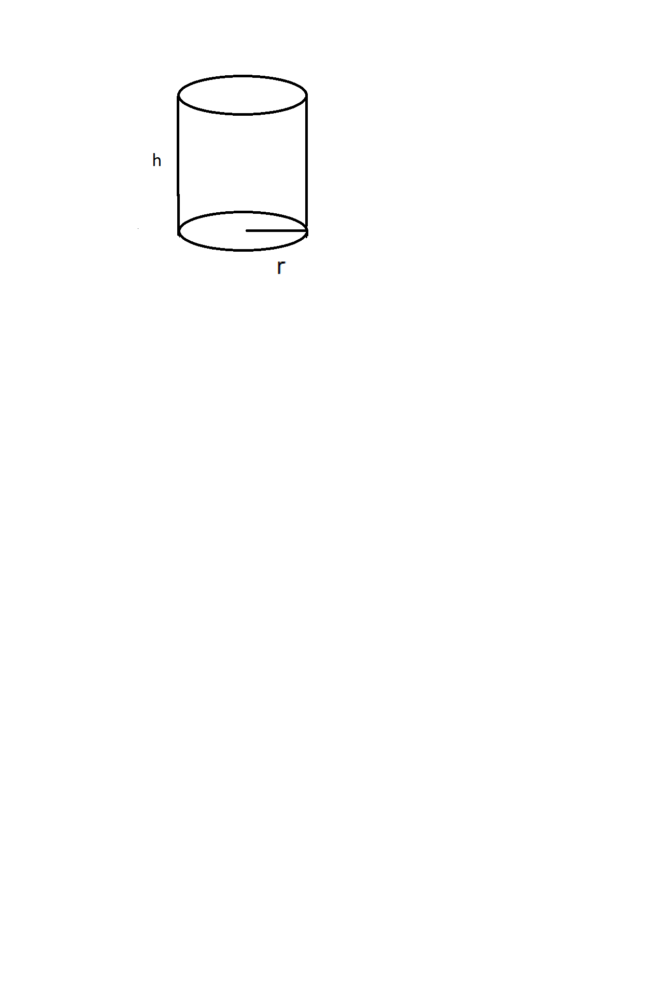
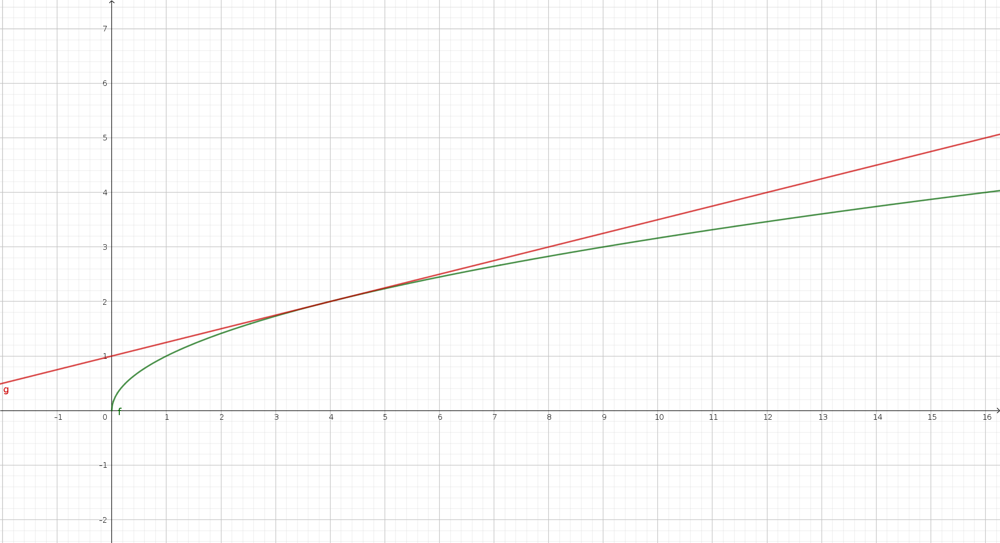
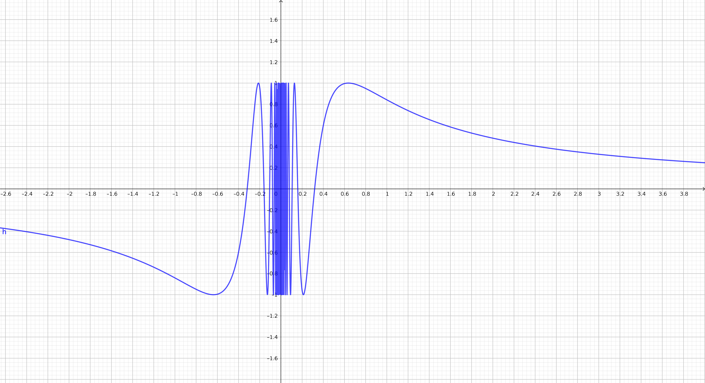

```{r setup, include=FALSE}
knitr::opts_chunk$set(echo = TRUE)
```

## Why study Calculus?

- Laws of Physics are stated using Calculus.

- Calculus can be applied to solve optimization problems: 'How much metal
do you need to make a can of a given volume'.

- Calculus can be used to calculate values of logarithmic and trigonometric functions with arbitrary precision (as well as many others).

## Regarding 1.

|Classical Application | 
|----------------------|
| Trajectory of a ball thrown diagonally  |
| Orbits of planets | 
| The pendulum  |
| Heat transfer | 
 
## Regarding 1.

|Classical Application | Modern Application |
|----------------------|----------------------|
| Trajectory of a ball thrown diagonally  | Cathode Ray Tube|
| Orbits of planets | Satelites|
| The pendulum  | AC circuits|
| Heat transfer | Options pricing, MP3|
  
 
## What are the dimensions of a can with given volume and minimal surface area?
 
 
 
## Regarding 2.

Suppose we are to construct a can of fixed volume $V$. Find the dimensions of the can, so that the amount
of metal used is minimal (i.e. minimize the surface area). Do not take the thickness of the metal used into
account when computing the volume of the can. 

Answer: Let $h$ denote the height and $r$ the radius of the base.

We have 
\[ V= \pi r^2h\]
\[ A(r,h)= 2\pi r h + 2 \pi r^2\]

## Next, we use the constraint (volume) to relate $r$ and $h$:
\[ h=\frac {V}{\pi r^2}\]

Now we can write the area as a function of a single variable:

\[ A(r) = 2\pi r \frac{V}{\pi r^2} + 2\pi r^2 = \frac{2V}{r} + 2\pi r^2\]

We can use calculus to find the value of $r$ which makes the function $A(r)$ the smallest.

## 
*The remainder of this example is for those who have seen derivatives.*

\[A'(r) = \frac{-2V}{r^2} +4\pi r\]

Now we look for critical points, i.e. the values of $r$ such that $A'(r)=0$:

\[A'(r)=0 \iff 4\pi r = \frac{2V}{r^2} \iff r^3 = \frac{2V}{4\pi} = \frac{2V}{\pi}\]

Now we compute the second derivative:

\[ A''(r) = \frac{4V}{r^3} + 4\pi > 0 \quad \textrm{for all}\quad r\]

By thesecond derivative test we conclude that the function has a strict minimum at the critical point.


## Regarding 3.

Computing values of functions. Consider the function $f(x) = \sqrt{x}$.





## The derivative gives a simple way to write the equation of the tangent line

\[ f'(x) = \frac{1}{2\sqrt {x}}\]

\[ f'(4) = \frac{1}{4}\]

The tangent line has the equation:

\[ y = \frac{1}{4}\left(x-4\right)+2\]

## Computing the value of $\pi$.

We start with the infinite geometric series:

\[ \frac{1}{1+t^2} = 1 - t^2 + t^4 - \dots\]

We integrate both sides:

\[ \arctan t = t - \frac{t^3}{3} + \frac{t^5}{5} - \dots \]

And finally,

\[ \arctan 1 = \frac{\pi}{4} = 1 - \frac{1}{3} + \frac{1}{5} - \frac{1}{7} + \dots \]

## Limits

Definiton: Assume that f(x) is defined in some open interval containing $x_0$, but not necessarily at $x_0$ itself.
We say that $f(x)$ approaches the limit $l$ as $x$ approaches $x_0$ and write
\[ \lim_{x\to x_0} f(x)=l\]
or
\[ f(x) \to l \quad \textrm{as}\quad x\to x_0 \]
if the values of $f(x)$ approach the number $l$ as $x$ approaches $x_0$ (but is not equal to it).

## Examples:

\[ \lim_{x\to 3} (4x+2) = 14 \]

\[ \lim_{x\to 4} \frac{x^2-16}{x-4} = \lim_{x\to 4} \frac{(x-4)(x+4)}{x-4}  = \lim_{x\to 4} x+4 = 8 \]

\[ \lim_{x\to 0} \frac{|x|}{x} \quad \textrm{Does not exist} (DNE)\]

This is because the one-sided limits are different.

\[ \lim_{x\to 0^+} \frac{|x|}{x} = 1\]

\[   \lim_{x\to 0^-} \frac{|x|}{x} = \lim_{x\to 0^-} \frac{-x}{x} =-1\]

## Here is an example of a function where both the one sided limits do not exist.




## Limit laws

Assume that 

\[ \lim_{x\to x_0} f(x) \qquad \textrm{and} \qquad \lim_{x\to x_0} g(x)\]

both exist. Then we have (if denominators nonzero):

\[\lim_{x\to x_0} \left(f(x) + g(x) \right) = \lim_{x\to x_0} f(x) + \lim_{x\to x_0} g(x)\]

\[\lim_{x\to x_0} \left(f(x) - g(x) \right) = \lim_{x\to x_0} f(x) - \lim_{x\to x_0} g(x)\]

\[\lim_{x\to x_0} \left(f(x) \cdot g(x) \right) = \lim_{x\to x_0} f(x) \cdot \lim_{x\to x_0} g(x)\]

\[\lim_{x\to x_0} \frac{f(x)}{g(x)}  = \frac{\lim_{x\to x_0} f(x)}{\lim_{x\to x_0} g(x)}\]

## Continuity

We say that a function $f(x)$ is continuous at $x_0$ if it is defined in some neighborhood of $x_0$ and we have

\[ \lim_{x\to x_0} f(x) = f(x_0)\]

The function $f(x)$ given by the fomula

\[ \begin{align}   1 \quad \textrm{for}\quad  x>0 \\
                        0 \quad \textrm{for}\quad x=0\\
                        -1 \quad \textrm{for} \quad x<0 \end{align}\]
is not continuous at $x_0=0$.
