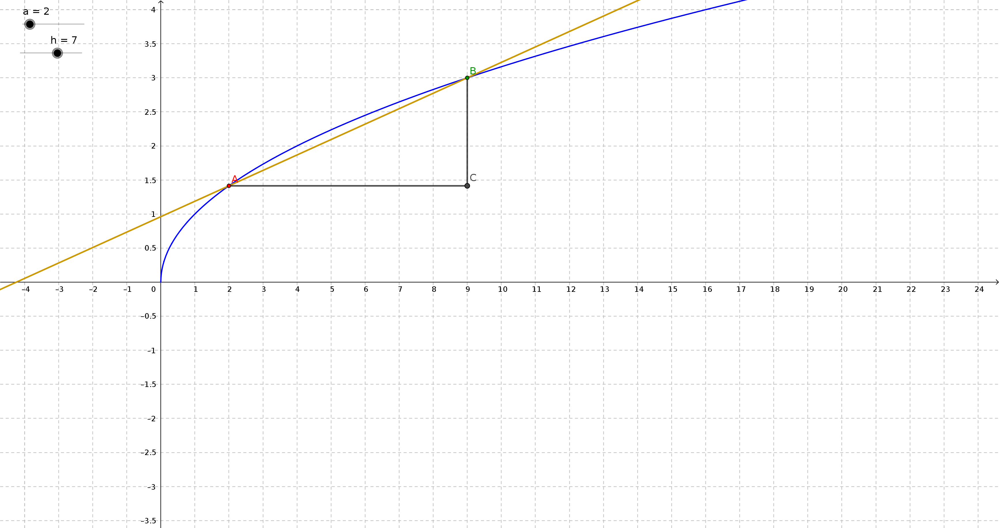

```{r setup, include=FALSE}
knitr::opts_chunk$set(echo = TRUE)
```

## Definition of Derivative

- Let $f(x)$ be a function whose domain contains an open interval about $x_0$. 
- We say that $f(x)$ is differentiable at $x_0$ when the following limit exists:

- \[ \lim_{h\to 0} \frac{f(x_0+h)-f(x_0)}{h}\]

- If the above limit exists we call it the derivative of $f(x)$ at $x_0$ and denote it by
$f'(x_0)$.

- Other notation:

- \[\frac{df}{dx}(x_0)\]
- \[ Df(x_0)\]


## Graphical interpretation of the definition



## Example 1 

 Compute the derivative of $f(x)=x^2$.  

 We have:

\[\begin{align} f'(x_0) &= \lim_{h\to 0} \frac{f(x_0+h)-f(x_0)}{h} \\
            &= \lim_{h\to 0} \frac{(x_0+h)^2-x_0^2}{h} \\
            &= \lim_{h\to 0} \frac{x_0^2+2x_0 h + h^2-x_0^2}{h} \\
            &= \lim_{h\to 0} \frac{2 x_0 h +h^2}{h} \\
            &= \lim_{h\to 0} {2 x_0  + h} \\
            &= 2 x_0  \\
\end{align}
\]

## Example 2 

Compute the derivative of $f(x)=\sqrt{x}$ at $x_0>0$.  

We have:

\[\begin{align} f'(x_0) &= \lim_{h\to 0} \frac{f(x_0+h)-f(x_0)}{h} \\
            &= \lim_{h\to 0} \frac{\sqrt{x_0+h}-\sqrt{x_0}}{h} \\
           &= \lim_{h\to 0} \frac{x_0+h-x_0}{h(\sqrt{x_0+h}+\sqrt{x_0})} \\
            &= \lim_{h\to 0} \frac{h}{h(\sqrt{x_0+h}+\sqrt{x_0})} \\
            &= \lim_{h\to 0} \frac{1}{\sqrt{x_0+h}+\sqrt{x_0}} =\frac{1}{2\sqrt{x_0}}\\
\end{align}
\]

## Example 3 

Compute the derivative of $f(x)=\frac{1}{x}$.  

We have:

\[\begin{align} f'(x_0) &= \lim_{h\to 0} \frac{f(x_0+h)-f(x_0)}{h} \\
            &= \lim_{h\to 0} \frac{\frac{1}{x_0+h}-\frac{1}{x_0}}{h} \\
            &= \lim_{h\to 0} \frac{1}{h}\frac{x_0-(x_0+h)}{(x_0+h)x_0} \\
            &= \lim_{h\to 0} \frac{1}{h}\frac{-h}{(x_0+h)x_0} \\
            &= \lim_{h\to 0} \frac{-1}{(x_0+h)x_0} = -\frac{1}{x_0^2} \\
\end{align}
\]

## Example 4 

Check whether the function $f(x)=|x|$ is differentiable at $x_0=0$.  
We have:
\[\begin{align} f'(x_0+) &= \lim_{h\to 0+} \frac{f(x_0+h)-f(x_0)}{h} \\
            &= \lim_{h\to 0+} \frac{|0+h|-|0|}{h} \\
             &= \lim_{h\to 0+} \frac{|h|}{h} =1 \\
            \end{align}
\]
\[\begin{align} f'(x_0-) &= \lim_{h\to 0-} \frac{|h|}{h} = -1 \\
            \end{align}
\]

The function  $|x|$ does not have a derivative at $x_0=0$.

## Theorem

If $f'(x_0)$ exists, then $f(x)$ is continuous at $x_0$, that is 
\[ \lim_{x\to x_0} f(x) = f(x_0) \]

 Proof: Equivalently, we need to show that
\[ \lim_{x\to x_0} \left( f(x) - f(x_0) \right) = 0 \]
We have

\[ \lim_{x\to x_0} (f(x) - f(x_0)) =
            \lim_{x\to x_0} \frac{ f(x) - f(x_0) }{x-x_0} (x-x_0) = f'(x_0)\cdot 0 \\
            = 0\]
            
## Note: 

- If the derivative of $f(x)$ exists for all $x$ in some set $\cal X$, then we obtain
a new function
\[ f' : \cal X \to \mathbb R\]

- As the example with the absolute value shows, the domain of $f'(x)$ can be strictly
smaller than the domain of $f(x)$.

- Other possible notation:
- \[ Df \quad\textrm{and}\quad  \frac{dy}{dx} \]

- Recall that: 
- \[ \mathbb N = \{1,2,3,\dots\} \]

## Theorem (The power rule)


 
If $f(x)=x^n$, $n\in \mathbb N$, then
\[ f'(x) = n x ^{n-1} \]

- Proof: Recal that
- \[ (a+b)^2 = a^2 + 2ab + b^2\]
- \[  (a+b)^3 = a^3+3 a^2 b + 3 a b^2 + b^3    \]

- In general, we have
- \[ (a+b)^n = \sum_{k=0}^{n} \binom n k a^k b^{n-k} \]

##

Where $\binom n k$ is the binomial coefficient:
\[ \binom n k = \frac{n!}{k!(n-k)!} \]

- We now have

- \[ \begin{align} 
        f'(x_0) &=  \lim_{h\to 0} \frac{f(x_0+h)-f(x_0)}{h} \\
                &=  \lim_{h\to 0} \frac{(x_0+h)^n-x_0^n}{h} \\
                &=  \lim_{h\to 0} \frac{x_0^n + n x_0^{n-1} h + \textrm{higher powers of h} -x_0^n}{h} \\
                &=  \lim_{h\to 0}  n x_0^{n-1}  + \textrm{terms involving h}  \\
                &=    n x_0^{n-1} \\
\end{align}\]

## Basic rules of differentiation

Suppose that $f(x)$ and $g(x)$ are differentiable functions of $x$, and $k$ is a constant.
We have:

- \[ [k f(x)]' = k f'(x) \] 
- \[ [f(x) + g(x)]' =  f'(x) + g'(x) \] 
- \[ [f(x) - g(x)]' =  f'(x) - g'(x) \] 
- \[ [f(x) g(x)]' =  f'(x) g(x) +f(x) g'(x) \]
- \[ \left(\frac{f(x)}{g(x)}\right)' =  \frac{f'(x) g(x) - f(x)g'(x)}{g^2(x)} \] 

- The last equality assumes $g(x)\neq 0$.

## Proof of the product rule:

\[ \begin{align}
[f(x)g(x)]' &=  \lim_{h\to 0} \frac{f(x_0+h)g(x_0+h)- f(x_0)g(x_0)}{h} \\
  &= \lim_{h\to 0} \frac{f(x_0+h)g(x_0+h) -  f(x_0)g(x_0+h)}{h}   \\                                      &\frac{ +f(x_0)g(x_0+h)-f(x_0)g(x_0)}{h} \\
  &= \lim_{h\to 0} \frac{f(x_0+h) -  f(x_0)}{h} g(x_0+h)       \\                           &+f(x_0)\frac{g(x_0+h)-g(x_0)}{h} \\
  &= f'(x_0) g(x_0) + f(x_0) g'(x_0)\\
\end{align}
\]

## Equation of line with given slope

\[ y - y_0 =m(x-x_0) \]

- Since the derivative gives the slope of the tangent line, the equation of the line
tangent to the graph of $y=f(x)$ at the point $x_0$ is given by
- \[ y-f(x_0) = f'(x_0) (x-x_0)\]
- or 
- \[ y = f(x_0)+f'(x_0) (x-x_0)\]

## Example

Use the tangent line to find the approximate value of $\sqrt{630}$.

- Answer: Take $f(x)=\sqrt{x}$. Hence
- \[f'(x)=\frac{1}{2\sqrt{x}}\]
- For $x_0=625$, we have $f'(x_0)=\frac{1}{50}$.
- Hence
- \[ \sqrt{630}\approx 25 + \frac{1}{50} 5 = 25.1\]

- In reality, $\sqrt{630}\approx 25.0998$.
